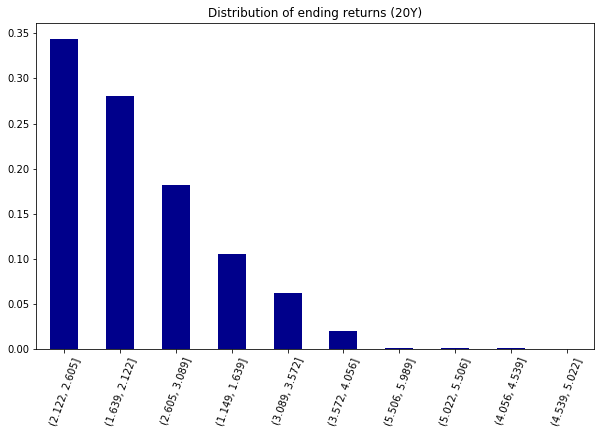

# Budget Analysis

We start our analysis by fetching transactions for the last 90 days. The categories in that set of data are the following:

    ['Payment']
    ['Food and Drink', 'Restaurants', 'Fast Food']
    ['Shops', 'Sporting Goods']
    ['Payment', 'Credit Card']
    ['Travel', 'Taxi']
    ['Transfer', 'Debit']
    ['Transfer', 'Deposit']
    ['Recreation', 'Gyms and Fitness Centers']
    ['Travel', 'Airlines and Aviation Services']
    ['Food and Drink', 'Restaurants', 'Fast Food']
    ['Food and Drink', 'Restaurants', 'Coffee Shop']
    ['Food and Drink', 'Restaurants']
    ['Transfer', 'Credit']
    ['Travel', 'Airlines and Aviation Services']
    ['Travel', 'Taxi']
    ['Food and Drink', 'Restaurants']
    ['Payment']
    ['Food and Drink', 'Restaurants', 'Fast Food']
    ['Shops', 'Sporting Goods']
    ['Payment', 'Credit Card']
    ['Travel', 'Taxi']
    ['Transfer', 'Debit']
    ['Transfer', 'Deposit']
    ['Recreation', 'Gyms and Fitness Centers']
    ['Travel', 'Airlines and Aviation Services']
    ['Food and Drink', 'Restaurants', 'Fast Food']
    ['Food and Drink', 'Restaurants', 'Coffee Shop']
    ['Food and Drink', 'Restaurants']
    ['Transfer', 'Credit']
    ['Travel', 'Airlines and Aviation Services']
    ['Travel', 'Taxi']
    ['Food and Drink', 'Restaurants']
    ['Payment']
    ['Food and Drink', 'Restaurants', 'Fast Food']
    ['Shops', 'Sporting Goods']
    ['Payment', 'Credit Card']
    ['Travel', 'Taxi']
    ['Transfer', 'Debit']
    ['Transfer', 'Deposit']
    ['Recreation', 'Gyms and Fitness Centers']
    ['Travel', 'Airlines and Aviation Services']
    ['Food and Drink', 'Restaurants', 'Fast Food']
    ['Food and Drink', 'Restaurants', 'Coffee Shop']
    ['Food and Drink', 'Restaurants']
    ['Transfer', 'Credit']
    ['Travel', 'Airlines and Aviation Services']
    ['Travel', 'Taxi']
    ['Food and Drink', 'Restaurants']
    ['Payment']
    ['Food and Drink', 'Restaurants', 'Fast Food']
    ['Shops', 'Sporting Goods']
    

We are then able to build a data_frame that provides us with a clean list of transactions by date. This is a small sample:

<table border="1" class="dataframe">
  <thead>
    <tr style="text-align: right;">
      <th></th>
      <th>Name</th>
      <th>Amount</th>
      <th>Category</th>
    </tr>
    <tr>
      <th>Date</th>
      <th></th>
      <th></th>
      <th></th>
    </tr>
  </thead>
  <tbody>
    <tr>
      <th>2020-04-24</th>
      <td>AUTOMATIC PAYMENT - THANK</td>
      <td>2078.5</td>
      <td>Payment</td>
    </tr>
    <tr>
      <th>2020-04-24</th>
      <td>KFC</td>
      <td>500.0</td>
      <td>Food and Drink</td>
    </tr>
    <tr>
      <th>2020-04-24</th>
      <td>Madison Bicycle Shop</td>
      <td>500.0</td>
      <td>Shops</td>
    </tr>
    <tr>
      <th>2020-04-15</th>
      <td>CREDIT CARD 3333 PAYMENT *//</td>
      <td>25.0</td>
      <td>Payment</td>
    </tr>
    <tr>
      <th>2020-04-15</th>
      <td>Uber</td>
      <td>5.4</td>
      <td>Travel</td>
    </tr>
  </tbody>
</table>

---

# Budget Analysis
Let's  analyse the customer's budget. We can calculate the expenses per category:

<table border="1" class="dataframe">
  <thead>
    <tr style="text-align: right;">
      <th></th>
      <th>Amount</th>
    </tr>
    <tr>
      <th>Category</th>
      <th></th>
    </tr>
  </thead>
  <tbody>
    <tr>
      <th>Food and Drink</th>
      <td>3317.19</td>
    </tr>
    <tr>
      <th>Payment</th>
      <td>6310.50</td>
    </tr>
    <tr>
      <th>Recreation</th>
      <td>235.50</td>
    </tr>
    <tr>
      <th>Shops</th>
      <td>1500.00</td>
    </tr>
    <tr>
      <th>Transfer</th>
      <td>20537.34</td>
    </tr>
    <tr>
      <th>Travel</th>
      <td>35.19</td>
    </tr>
  </tbody>
</table>

This can be illustrated in the following pie chart:

    array([<matplotlib.axes._subplots.AxesSubplot object at 0x000001B08E011B00>],
          dtype=object)

We can also provide the number of transactions per category:

    <matplotlib.axes._subplots.AxesSubplot at 0x1b08f16c898>

### These are the expenses per month:

<table border="1" class="dataframe">
  <thead>
    <tr style="text-align: right;">
      <th></th>
      <th>Amount</th>
    </tr>
    <tr>
      <th>Date_Y_M</th>
      <th></th>
    </tr>
  </thead>
  <tbody>
    <tr>
      <th>2020-01</th>
      <td>4084.83</td>
    </tr>
    <tr>
      <th>2020-02</th>
      <td>10145.24</td>
    </tr>
    <tr>
      <th>2020-03</th>
      <td>11145.24</td>
    </tr>
    <tr>
      <th>2020-04</th>
      <td>6560.41</td>
    </tr>
  </tbody>
</table>

    <matplotlib.axes._subplots.AxesSubplot at 0x1b08f1e9a20>

### Use the API to fetch income data from the sandbox and print the following:

#### Last Year's Income Before Tax

We need to fetch the income data from the sandbox

    {'income': {'income_streams': [{'confidence': 0.99,
        'days': 720,
        'monthly_income': 500,
        'name': 'UNITED AIRLINES'}],
      'last_year_income': 6000,
      'last_year_income_before_tax': 7285,
      'max_number_of_overlapping_income_streams': 1,
      'number_of_income_streams': 1,
      'projected_yearly_income': 6085,
      'projected_yearly_income_before_tax': 7389},
     'request_id': '2ye0cqFDbcNnyf6'}

    Last year's income before tax was: $7285
    

#### Current Monthly Income

    Current monthly income is: $500
    

#### Projected Year's Income Before Tax

    Projected Year's Income Before Tax is: $7389
    
# Portfolio Analysis

Using Alpaca's API we can fetch closing prices for the `SPY` and `AGG` tickers. We will build a portfolio using these two stocks. 

**As we want to forecast to 30 years I will use data for the last 5 years in order to estimate parameters**

This is a sample of data for AGG

<table border="1" class="dataframe">
  <thead>
    <tr>
      <th></th>
      <th colspan="5" halign="left">AGG</th>
    </tr>
    <tr>
      <th></th>
      <th>open</th>
      <th>high</th>
      <th>low</th>
      <th>close</th>
      <th>volume</th>
    </tr>
    <tr>
      <th>time</th>
      <th></th>
      <th></th>
      <th></th>
      <th></th>
      <th></th>
    </tr>
  </thead>
  <tbody>
    <tr>
      <th>2015-01-02 00:00:00-05:00</th>
      <td>110.18</td>
      <td>110.50</td>
      <td>110.18</td>
      <td>110.45</td>
      <td>1766432</td>
    </tr>
    <tr>
      <th>2015-01-05 00:00:00-05:00</th>
      <td>110.56</td>
      <td>110.76</td>
      <td>110.48</td>
      <td>110.67</td>
      <td>3220575</td>
    </tr>
    <tr>
      <th>2015-01-06 00:00:00-05:00</th>
      <td>110.96</td>
      <td>111.35</td>
      <td>110.89</td>
      <td>110.97</td>
      <td>3089810</td>
    </tr>
    <tr>
      <th>2015-01-07 00:00:00-05:00</th>
      <td>111.00</td>
      <td>111.04</td>
      <td>110.74</td>
      <td>110.92</td>
      <td>3616860</td>
    </tr>
    <tr>
      <th>2015-01-08 00:00:00-05:00</th>
      <td>110.84</td>
      <td>110.84</td>
      <td>110.63</td>
      <td>110.74</td>
      <td>1873126</td>
    </tr>
  </tbody>
</table>

This is a sample for SPY:

<table border="1" class="dataframe">
  <thead>
    <tr>
      <th></th>
      <th colspan="5" halign="left">SPY</th>
    </tr>
    <tr>
      <th></th>
      <th>open</th>
      <th>high</th>
      <th>low</th>
      <th>close</th>
      <th>volume</th>
    </tr>
    <tr>
      <th>time</th>
      <th></th>
      <th></th>
      <th></th>
      <th></th>
      <th></th>
    </tr>
  </thead>
  <tbody>
    <tr>
      <th>2015-01-02 00:00:00-05:00</th>
      <td>206.38</td>
      <td>206.88</td>
      <td>204.180</td>
      <td>205.41</td>
      <td>94506045</td>
    </tr>
    <tr>
      <th>2015-01-05 00:00:00-05:00</th>
      <td>204.17</td>
      <td>204.37</td>
      <td>201.350</td>
      <td>201.80</td>
      <td>133100354</td>
    </tr>
    <tr>
      <th>2015-01-06 00:00:00-05:00</th>
      <td>202.09</td>
      <td>202.72</td>
      <td>198.855</td>
      <td>199.82</td>
      <td>166955423</td>
    </tr>
    <tr>
      <th>2015-01-07 00:00:00-05:00</th>
      <td>201.42</td>
      <td>202.72</td>
      <td>200.880</td>
      <td>202.34</td>
      <td>103285826</td>
    </tr>
    <tr>
      <th>2015-01-08 00:00:00-05:00</th>
      <td>204.00</td>
      <td>206.16</td>
      <td>203.990</td>
      <td>205.92</td>
      <td>112316394</td>
    </tr>
  </tbody>
</table>

We are only interested in the close:

<table border="1" class="dataframe">
  <thead>
    <tr style="text-align: right;">
      <th></th>
      <th>AGG</th>
      <th>SPY</th>
    </tr>
  </thead>
  <tbody>
    <tr>
      <th>2019-12-27</th>
      <td>112.62</td>
      <td>322.86</td>
    </tr>
    <tr>
      <th>2019-12-30</th>
      <td>112.63</td>
      <td>321.10</td>
    </tr>
    <tr>
      <th>2019-12-31</th>
      <td>112.37</td>
      <td>321.92</td>
    </tr>
  </tbody>
</table>

# Monte Carlo Simulation

In this step, we will run Monte Carlo Simulations for the portfolio to model portfolio performance at different retirement ages. 

We will complete the following steps:
1. Calculate the daily returns for the SPY and AGG closing prices.
2. Calculate volatility for both the SPY and AGG closing prices.
3. Find the last day's closing price for both stocks and save those as variables.
4. Run a Monte Carlo Simulation of at least 500 iterations and generate at least 30 years of closing prices

These are the daily returns:

    AGG    0.000016
    SPY    0.000394

These the daily volatilities

    AGG    0.002027
    SPY    0.008484

In order to run the MC simulation we need to save the close of the last day:

    112.37
    321.92
    

We will use 500 simulations going forward in time 30 years. The assumption is that prices are normally distributed. The portfolio will be made of 60% AGG and 40%  SPY
This is a sample of the price evolution for some simulations:

<table border="1" class="dataframe">
  <thead>
    <tr style="text-align: right;">
      <th></th>
      <th>0</th>
      <th>1</th>
      <th>2</th>
      <th>3</th>
      <th>4</th>
      <th>5</th>
      <th>6</th>
      <th>7</th>
      <th>8</th>
      <th>9</th>
      <th>...</th>
      <th>490</th>
      <th>491</th>
      <th>492</th>
      <th>493</th>
      <th>494</th>
      <th>495</th>
      <th>496</th>
      <th>497</th>
      <th>498</th>
      <th>499</th>
    </tr>
  </thead>
  <tbody>
    <tr>
      <th>0</th>
      <td>1.000000</td>
      <td>1.000000</td>
      <td>1.000000</td>
      <td>1.000000</td>
      <td>1.000000</td>
      <td>1.000000</td>
      <td>1.000000</td>
      <td>1.000000</td>
      <td>1.000000</td>
      <td>1.000000</td>
      <td>...</td>
      <td>1.000000</td>
      <td>1.000000</td>
      <td>1.000000</td>
      <td>1.000000</td>
      <td>1.000000</td>
      <td>1.000000</td>
      <td>1.000000</td>
      <td>1.000000</td>
      <td>1.000000</td>
      <td>1.000000</td>
    </tr>
    <tr>
      <th>1</th>
      <td>1.000302</td>
      <td>0.999411</td>
      <td>0.997878</td>
      <td>1.003326</td>
      <td>1.008589</td>
      <td>0.996631</td>
      <td>0.998919</td>
      <td>1.008396</td>
      <td>1.000447</td>
      <td>0.996255</td>
      <td>...</td>
      <td>1.001326</td>
      <td>0.993935</td>
      <td>1.001819</td>
      <td>1.001465</td>
      <td>0.996825</td>
      <td>1.002217</td>
      <td>1.000241</td>
      <td>1.003542</td>
      <td>0.998730</td>
      <td>0.995586</td>
    </tr>
    <tr>
      <th>2</th>
      <td>1.006427</td>
      <td>1.002436</td>
      <td>1.000725</td>
      <td>0.996732</td>
      <td>1.007067</td>
      <td>0.994898</td>
      <td>0.995664</td>
      <td>1.002341</td>
      <td>0.999490</td>
      <td>0.995332</td>
      <td>...</td>
      <td>1.003783</td>
      <td>0.995773</td>
      <td>1.002888</td>
      <td>1.003735</td>
      <td>0.997314</td>
      <td>0.993443</td>
      <td>1.000562</td>
      <td>1.002232</td>
      <td>0.996896</td>
      <td>0.998559</td>
    </tr>
    <tr>
      <th>3</th>
      <td>1.005508</td>
      <td>1.001713</td>
      <td>1.000922</td>
      <td>0.996631</td>
      <td>1.005310</td>
      <td>0.990305</td>
      <td>0.998589</td>
      <td>0.997070</td>
      <td>0.999065</td>
      <td>1.001787</td>
      <td>...</td>
      <td>1.004094</td>
      <td>0.991482</td>
      <td>1.003663</td>
      <td>1.006591</td>
      <td>0.993122</td>
      <td>0.994760</td>
      <td>1.004503</td>
      <td>0.998215</td>
      <td>0.998705</td>
      <td>1.001122</td>
    </tr>
    <tr>
      <th>4</th>
      <td>1.010226</td>
      <td>1.003336</td>
      <td>1.003340</td>
      <td>1.000082</td>
      <td>1.009233</td>
      <td>0.991570</td>
      <td>1.001536</td>
      <td>0.992212</td>
      <td>1.000983</td>
      <td>1.003389</td>
      <td>...</td>
      <td>1.002149</td>
      <td>0.993434</td>
      <td>1.003499</td>
      <td>1.002599</td>
      <td>0.994629</td>
      <td>0.993497</td>
      <td>1.001576</td>
      <td>1.000080</td>
      <td>0.997723</td>
      <td>1.001724</td>
    </tr>
  </tbody>
</table>

5 rows × 500 columns

 We can visualize the simulation:

Visualize the distribution of the ending returns

Visualize the distribution of the returns after 20 years

Display the 90% confidence interval for the ending returns

# Retirement Analysis

In this section we will use the monte carlo model to answer the following retirement planning questions:

1. What are the expected cumulative returns at 30 years for the 10th, 50th, and 90th percentiles?
2. Given an initial investment of `$20,000`, what is the expected portfolio return in dollars at the 10th, 50th, and 90th percentiles?
3. Given the current projected annual income from the Plaid analysis, will a 4% withdraw rate from the retirement portfolio meet or exceed that value at the 10th percentile?
4. How would a 50% increase in the initial investment amount affect the 4% retirement withdrawal?

What are the expected cumulative returns at 30 years for the 10th, 50th, and 90th percentiles?

     The expected cumulative return at 30 years for the 10th percentile is: 2.2655749959352955
     The expected cumulative return at 30 years for the 50th percentile is: 3.408329303822989
     The expected cumulative return at 30 years for the 90th percentile is: 4.902706408442041
    

Given an initial investment of `$20,000`, what is the expected portfolio return in dollars at the 10th, 50th, and 90th percentiles?

     The expected portfolio return at 30 years for the 10th percentile is: $25311.499918705907
     The expected portfolio return at 30 years for the 50th percentile is: $48166.58607645979
     The expected portfolio return at 30 years for the 90th percentile is: $78054.12816884082
    

Given the current projected annual income from the Plaid analysis, will a 4% withdraw rate from the retirement portfolio meet or exceed that value at the 10th percentile?

Note: This is effectively saying that 90% of the expected returns will be greater than the return at the 10th percentile, so this can help measure the uncertainty about having enough funds at retirement

I understand the question as this: *Can 4% of the retirement portfolio replace the annual income if we still want the retirement portfolio to growth to the current 10th percentile? I assume the interest rate is 0.*

From the Plaid analysis we have that the projected annual income is 7,389. Over the course of 30 years the total income would be (assuming interest rates are 0) 221,670. 

We need to withdraw 4% every year from the retirement portfolio. That number in Present-Value (PV) terms is:

PV = (1 + 0.04)**(-30)

    0.3083186679734204
    

So the initial investment for the retirement portfolio would be reduced
to  (20,000 * 30.83%) = 6,166.37. 

We found above that the expected cumulative return at the 10th percentile is 2.26. The portfolio would grow to (6,166.37 * 2.26) = 13,937. This figure is very far away from the income that we would lose over the course of 30 years.

**Answer: A 4% withdraw rate in the retirement portfolio would not replace the projected annual income** 

How would a 50% increase in the initial investment amount affect the 4% retirement withdrawal?

A 50% increase in the initial investment is still not enough. The  retirement portfolio value after 30 years would be (30,000 * 2.26) = 67,800. This figure is still very far away from the 221,670 total projected income. To replace income over 30 years the initial investment amount would have to be at least (221,670 / 2.26) = 98,084.

### Optional Challenge

In this section, we will calculate and plot the cumulative returns for the median and 90% confidence intervals. This plot shows the expected cumulative returns for any given day between the first day and the last day of investment. 

This is a sample of the cumulative returns for those quantiles:

<table border="1" class="dataframe">
  <thead>
    <tr style="text-align: right;">
      <th></th>
      <th>median</th>
      <th>5% quantile</th>
      <th>95% quantile</th>
    </tr>
  </thead>
  <tbody>
    <tr>
      <th>7558</th>
      <td>3.401474</td>
      <td>2.097571</td>
      <td>5.469059</td>
    </tr>
    <tr>
      <th>7559</th>
      <td>3.402047</td>
      <td>2.092910</td>
      <td>5.460218</td>
    </tr>
    <tr>
      <th>7560</th>
      <td>3.408329</td>
      <td>2.097050</td>
      <td>5.465309</td>
    </tr>
  </tbody>
</table>

___

## Optional Challenge — Early Retirement

Harold was really impressed with your work on this planner, but commented that 30 years seems like such a long time to wait to retire! Harold starts wondering if the retirement plan could be adjusted to retire earlier than normal. Try adjusting the portfolio to either include more risk (a higher stock than bond ratio) or to have a larger initial investment and rerun the retirement analysis to see what it would take to retire in five years instead of 30!

Let's use the median as the statistic we want to achieve after 30 years

<table border="1" class="dataframe">
  <thead>
    <tr style="text-align: right;">
      <th></th>
      <th>median</th>
    </tr>
  </thead>
  <tbody>
    <tr>
      <th>0</th>
      <td>1.000000</td>
    </tr>
    <tr>
      <th>1</th>
      <td>1.000247</td>
    </tr>
    <tr>
      <th>2</th>
      <td>1.000344</td>
    </tr>
    <tr>
      <th>3</th>
      <td>1.000858</td>
    </tr>
    <tr>
      <th>4</th>
      <td>1.000775</td>
    </tr>
  </tbody>
</table>

The cumulative return after five years is given at point (252 * 5) = 1260:

    1.2365231816599405

the median cumulative return after 30 years is:

    3.408329303822989

To retire in 5y instead of 30y Harold would need to initially invest:
result = (cum_return_30Y / cum_return_5Y) * 20000
result 

    55127.624849662105

